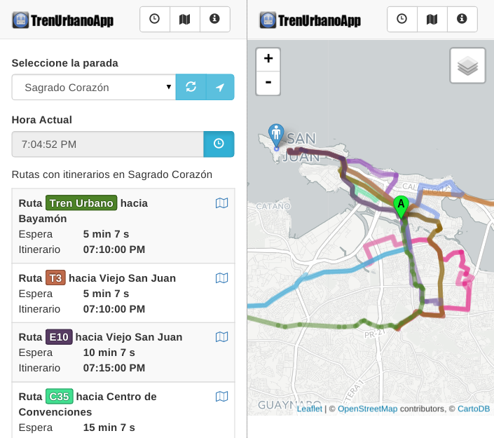

# Tren Urbano App

La legendaria aplicación de transporte público del Área Metro de San Juan. Escrita en Java 8, 
sobre la base de datos PostgreSQL versión 9.2+ con la extensión PostGIS

## Build

Requisitos

* Java 8 JDK
* NodeJS NPM
* PostgreSQL 9.2+
* PostGIS

## Compilar codigo java y javascript

    $ ./gradlew build install

## Base de datos

Crear base de datos con extension PostGIS

    $ psql -U postgres
    postgres=# create database tuapp; --o el nombre de base de datos que desees
    postgres=# \c tuapp
    tuapp=# create extension postgis;
    tuapp=# \q
    
Poblar base de datos con scripts ubicados en directorio 'db'    

    $ cat db/common/ref.sql db/common/logs.sql | psql -U postgres -d tuapp

### Cómo correr el sistema

Puedes correr Tren Urbano App en tu contenedor web favorito (e.g. Tomcat 7+). Los siguientes argumentos del JVM son requeridos:

    # Configuracion de BD. Archivo de ejemplo incluído en el directorio db/
    -Dconfig.property.file=/absolute/path/to/config.properties
